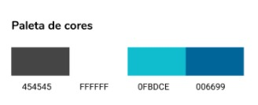

# GamaAcademy_SiteOng

## Motivação

O projeto do qual esse site é parte, é um dos desafios do GAMA XP 39, desenhado pelo Gama Academy. 

A motivação principal desse projeto é alavancar digitalmente uma ONG de escolha da equipe, atacando as principais dores que impedem o crescimento digital desta mesma ONG.

## Objetivo

Composto de uma equipe multidisciplinar, o projeto conta com estudantes e profissionais de UX/UI e com desenvolvedores FullStack, sendo este documento a ser lido focado no trabalho dos membros FullStack. Caso haja interesse em conhecer a parte do trabalho dos Designers, favor acessar: https://medium.com/@jherrero/volunt%C3%A1rios-digitais-ong-qualivida-projeto-esporte-para-todos-a9b26667fc2f

Falando de entregáveis, pensamos primeiramente em um site institucional construído no WordPress com o auxílio do Elementor publicado no Git Pages contendo:
- Storytelling tanto da ONG quanto de sua fundadora;
- Fotos das atividades da ONG;
- Contatos;
- Serviços prestados.

Infelizmente não encontramos um jeito fácil e rápido de conseguir fazer o site do WordPress para publicá-lo no Git Pages. Portanto optamos por fazê-lo usando apenas HTML e CSS.

## Equipe
- FullStack
  - Alecio Junior
  - Guilherme Bublitz
  - Ícaro Dias
  - Marciolino
  
   
- Designers UX/UI
  - Camila lima
  - Higor Miranda
  - Jorge Herrero
  - Nicholas Reinold

- Definição do repositório GIT e Planejamento das estórias/Sprints para execução da tarefa.

## Escopo

A Ong Qualivida, fundada professora de Educação Física Georgette Vidor Mello, realiza o Projeto “Esporte para Todos”, de cunho sócio esportivo, que oferece o acesso gratuito à prática do esporte, atendendo crianças e adolescentes da rede pública de ensino, na faixa etária entre 4 a 17 anos de idade.

## Atualizações do projeto

12/11/2021 - A v1 do site foi feita usando somente HTML e CSS, como decidido pelo time. Ainda apresenta falhas de responsividade que espera-se que sejam corrigidas ao longo do tempo com a maior aquisição de conhecimento e engajamentos dos projetistas.

# Ferramentas usadas ao longo do projeto

## FullStack
- [WordPress](https://wordpress.com/pt-br/)
- [VSCode](https://code.visualstudio.com/)
- Git e GitHub

## Designer 
- Figma 

    - [Wireframe](https://www.figma.com/file/Pemj6ThEnr767xdMT1R2UK/Site-ONG-QualiVida?node-id=0%3A1)

    - [Protótipo](https://www.figma.com/proto/Pemj6ThEnr767xdMT1R2UK/Site-ONG-QualiVida?page-id=33%3A2&node-id=123%3A2&viewport=241%2C48%2C0.27&scaling=min-zoom&starting-point-node-id=123%3A2)

- [Adobe Illustrator](https://www.adobe.com/br/products/illustrator)

## Equipe
- [Notion](https://curvy-somersault-dec.notion.site/Volunt-rios-Digitais-ONG-QualiVida-Projeto-Esporte-para-Todos-8e5f591b0b7943f08a9bca4b23fa2970)

- [Medium](https://medium.com/@jherrero/volunt%C3%A1rios-digitais-ong-qualivida-projeto-esporte-para-todos-a9b26667fc2f)

- [Miro](https://miro.com/welcomeonboard/Q1pmTjZFS1AxcFJNQnY5dkxNMU5PTHJCckRKamZ5OTlQNjliZHQyREtVOGdzNTJhY1AzcjZhdGQ4YUZ4REdmR3wzMDc0NDU3MzYzNDUzNTA0ODY0?invite_link_id=706179014050)

- [Trello](https://trello.com/c/wZ2b1rrs/14-desenvolvimento-do-site-institucional-da-ong-e-linktree)

## 3 - Definindo paleta de cores
    - Respeitando ao máximo as cores já esolhidas previamente na confecção do logo do cliente, foi confeccionada pelo time de Designer uma restruturação de logo.
    
   
`Principais cores`

    `#454545`

   `#ffffff`
  
   `#0fbdce`

   `#006699`

Utilizando a ferramenta  [Adobe Color](https://color.adobe.com/), definimos a paleta de cores registradas abaixo:

## 4 - Definindo Tipografia
#### Fonte principal:
  
  
#### Fonte secundária:
 
 

  
 
 
